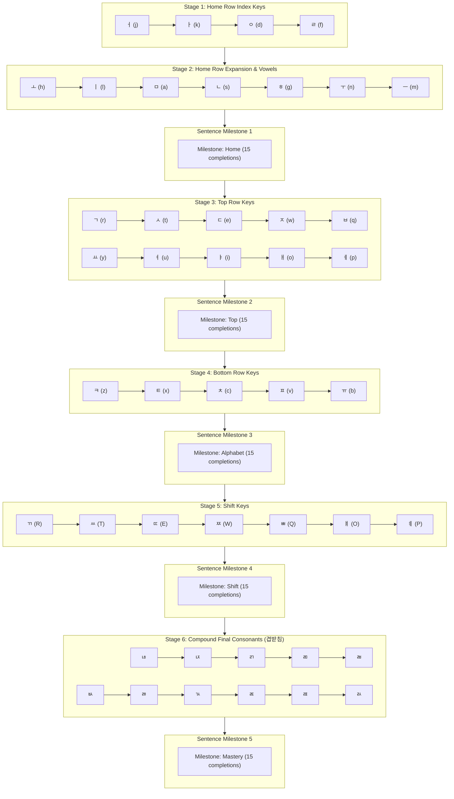

# Mastery Mode Design Document

The **Mastery Mode** engine is an adaptive, spaced-repetition typing tutor designed to guide
English-speaking learners from zero Korean typing experience to fluent touch-typing on the standard
Dubeolsik (2-set) keyboard layout.

---

## 1. Design Objectives & Principles

1. **Muscle Memory Isolation:** Introduce new finger reaches one key at a time, moving outward
   ergonomically from the home-row index fingers.
2. **Immediate Authenticity:** Practice real Korean words from the very first key combination rather
   than random gibberish strings.
3. **Cognitive Load Management:**
   - **During Jamo Introduction:** Strictly restrict exercises to **short words and concise
     phrases** ($\le 12$ characters / 1–3 words) containing the target Jamo and previously mastered
     letters.
   - **Between Keyboard Sections:** Present dedicated **Sentence Milestone Checkpoints** where
     learners practice medium-to-long sentences to develop typing rhythm, spacebar timing, and
     sentence-level muscle memory.
4. **Graduated Mastery Thresholds:**
   - **Jamo Mastery:** 20 keystrokes evaluated on a sliding window with $\ge 95\%$ rolling accuracy.
   - **Sentence Checkpoint Mastery:** 15 completed sentences.
5. **Deterministic Gating:** Mathematically verify that every single character in an exercise
   belongs to the learner's unlocked letter set before presenting it.

---

## 2. Progression Structure & Sequence

The progression combines single-Jamo learning stages with interleaved sentence checkpoints:

---

## 3. Vocabulary Bank & Length Rules

### Jamo Learning Stages (Short Words & Phrases)

- Target length: $\le 12$ characters (typically 1–3 words).
- Each Jamo step has a dedicated curated bank of authentic words constructed strictly from the
  cumulative set of Jamos unlocked up to that step.
- Long sentences are explicitly excluded during Jamo introduction to prevent cognitive fatigue.

### Sentence Milestone Checkpoints (Medium-to-Long Sentences)

- Target length: $\ge 10$ characters (multi-word natural sentences).
- Focuses on conversational phrasing, honorifics, punctuation, and typing cadence.
- 15 completed sentences advance the learner to the next keyboard section.

---

## 4. Item Selection Algorithm (Two-Pass Selection)

When picking the next exercise in Mastery mode:

1. **Pass 1 — Focus Coin Flip (70% Focus Pool Bias):**
   - If the active stage is a Jamo stage with an unmastered frontier key, 70% of draws are
     restricted strictly to words containing the active Jamo.
   - 30% of draws draw from the entire cumulative unlocked vocabulary to reinforce previously
     learned keys.
2. **Pass 2 — Error-Weighted Random Sampling:**
   - **Base Weight:** `1.0`
   - **Struggling Jamo Bonus:** Continuous error-weighted boost for each constituent Jamo with
     rolling accuracy $< 95\%$:
     $$\text{Weight} = \text{BaseWeight} + \sum_{j \in \text{jamos}} \max(0, (0.95 - \text{Accuracy}_j) \times 8.0)$$
   - **Adaptive Length Multiplier:** Biases word lengths according to the active Jamo's progress
     (0–30%, 30–70%, 70–100%).
   - **No Immediate Repetition:** The item just completed is excluded from candidates whenever
     multiple eligible choices exist.

---

## 5. Error-Weighted Rolling Review Architecture

To ensure learners maintain long-term muscle memory across all previously unlocked keys without the
friction of calendar-based flashcard queues (Anki/SM-2 intervals), the tutor incorporates an
**autonomous rolling error-weighted review engine**:

1. **Continuous Weak Key Detection:** The prompt generator analyzes the 20-keystroke rolling history
   of every unlocked Jamo.
2. **Seamless In-Flow Reinforcement:** Rather than forcing the user into a separate "Review Mode" or
   presenting an intimidating backlog of "overdue" keys, vocabulary containing weaker or error-prone
   keys automatically receives higher sampling probability during standard mastery sessions.
3. **End-of-Stage Cumulative Checkpoints:** Each stage concludes with a 10-sentence Milestone
   checkpoint testing cumulative recall of all keys introduced so far in full authentic Korean
   sentences.

---

## 6. State Persistence & Manual Override

- **Persistence:** Progress is stored in `localStorage` under `korean_tutor_mastery` and debounced
  (30s inactivity or on page unload) to prevent mobile I/O overhead.
- **Manual Stage Selection:** The **Mastery Sidebar** allows learners to manually jump to any
  individual Jamo milestone or Sentence Checkpoint, automatically unlocking preceding keys.
- **Clean Slate Reset:** A reset option clears all Jamo history and sets progress back to Stage 1.

---

## 7. Graduation Celebration & Next Steps

Upon graduating the final Milestone (**Sentence Milestone 5 / Compound Batchim**):

1. **Celebration Dialog (`MasteryCompletionModal.svelte`):** A high-contrast modal dialog appears
   congratulating the learner on mastering all 44 Hangul Jamos and 5 Sentence Milestones.
2. **Actionable Pathways:**
   - **Switch to Free-form Mode:** Easily transition to practice the full 26-module library of
     authentic vocabulary, TOPIK levels, idioms, and literature without progression locks.
   - **Targeted Practice:** Open the Mastery Progress Drawer to jump to any specific stage or
     milestone to hone speed and accuracy on specific keyboard rows.
   - **Batchim Workshop:** Master all 11 complex compound double final consonants (ㄳ, ㄵ, ㄼ, etc.)
     with dedicated focus datasets.
   - **Continue in Master Level:** Keep practicing the rich mix of authentic master-level passages
     and public domain Korean poetry.
